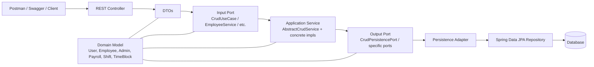

# RH Service

Spring Boot microservice for human resources built with clean architecture, explicit object-oriented design, and a REST API with JSON payloads.

## Overview

This service now includes:

- Domain entities with inheritance: `User -> Employee / Admin`
- Application input ports for use cases
- Application services that coordinate business actions
- Output ports for persistence
- Persistence adapters and Spring Data JPA repositories
- REST controllers that expose JSON endpoints
- Session-based login and logout
- Startup seeding for one default admin and one default employee
- DTOs for request and response payloads
- Monthly payroll generation with overtime premium calculation
- PDF paystub generation for payroll entries
- OpenAPI / Swagger UI for API exploration
- H2 for local development

## Architecture

The code follows a clean / hexagonal style:

- `domain/model/` contains the business entities and value objects.
- `application/port/in/` defines the use cases that the outside world can call.
- `application/port/out/` defines the persistence contracts.
- `application/service/impl/` implements the use cases.
- `infrastructure/persistence/adapter/` adapts the application ports to Spring Data JPA.
- `infrastructure/persistence/jpa/` contains the repository interfaces.
- `infrastructure/web/controller/` exposes the REST API.
- `infrastructure/web/dto/` contains JSON request and response objects.

## OOP Principles Used

- Encapsulation: each model keeps its own state and exposes it through generated accessors.
- Inheritance: `User` is the abstract base class shared by `Employee` and `Admin`.
- Abstraction: ports define behavior without exposing framework details.
- Polymorphism: the application layer depends on interfaces, so implementations can be replaced without changing callers.
- Single Responsibility: each class has one job, such as modeling data, implementing a use case, adapting persistence, or exposing HTTP endpoints.
- Dependency Inversion: services depend on persistence ports, not concrete repositories.
- Adapter Pattern: persistence adapters connect the application ports to Spring Data JPA.

## Semi-visual Data Flow

The request flow is:



How the data evolves:

1. A client sends JSON to a REST controller.
2. The controller receives the payload in a DTO.
3. The controller maps the DTO to a domain entity.
4. The controller calls an input port, not a repository directly.
5. The application service applies the use-case rule and coordinates the operation.
6. The service calls an output port to persist or fetch data.
7. The adapter translates that call to a Spring Data repository.
8. JPA stores or retrieves the entity from the database.
9. The response flows back as a DTO and then as JSON.

## API Endpoints

Base path: `http://localhost:8082/api`

- `POST /auth/login`
- `POST /auth/logout`
- `GET /employees`
- `GET /employees/{id}`
- `POST /employees`
- `PUT /employees/{id}`
- `DELETE /employees/{id}`
- `GET /admins`
- `GET /admins/{id}`
- `POST /admins`
- `PUT /admins/{id}`
- `DELETE /admins/{id}`
- `GET /payrolls`
- `GET /payrolls/{id}`
- `POST /payrolls`
- `POST /payrolls/generate`
- `GET /payrolls/{id}/paystub`
- `PUT /payrolls/{id}`
- `DELETE /payrolls/{id}`
- `GET /shifts`
- `GET /shifts/{id}`
- `POST /shifts`
- `PUT /shifts/{id}`
- `DELETE /shifts/{id}`

## JSON Examples

### Create an employee

```json
{
    "name": "Ana Perez",
    "username": "ana.perez",
    "password": "secret123",
    "telephone": "555-111-222",
    "address": "Main Street 123",
    "bankAccount": "ES123456789",
    "monthlyHours": 160,
    "salary": 2500,
    "shiftId": 1
}
```

### Create an admin

```json
{
    "name": "Laura Gomez",
    "username": "laura.gomez",
    "password": "secret123",
    "telephone": "555-333-444",
    "address": "Admin Avenue 10",
    "bankAccount": "ES987654321",
    "permissions": "ROLE_HR_MANAGER"
}
```

### Default login accounts

These users are created automatically every time the application starts because the project uses an in-memory H2 database.

- Admin username: `admin`
- Admin password: `supersecurepassword`
- Employee username: `employee1`
- Employee password: `supernormalpassword`

### Create a payroll record

```json
{
    "month": "May",
    "year": "2026",
    "paid": false,
    "amount": 2500,
    "employeeId": 1
}
```

### Generate monthly payroll with overtime

```json
{
    "employeeId": 1,
    "month": "July",
    "year": "2026"
}
```

The system calculates the payroll amount from the employee's hourly salary, monthly target hours, weekly shift schedule, and overtime premium. If the employee works more hours than their monthly target, the extra hours are paid at a 10% overtime premium.

### Create a shift

```json
{
    "monday": [
        { "start": "08:00:00", "end": "12:00:00" },
        { "start": "13:00:00", "end": "17:00:00" }
    ],
    "tuesday": [],
    "wednesday": [],
    "thursday": [],
    "friday": [],
    "saturday": [],
    "sunday": []
}
```

## How to Use the API

1. Start the service.
2. Log in with `POST /api/auth/login` using one of the default accounts above.
3. Create a shift if you want to assign one to an employee.
4. Create extra employees or admins using the JSON examples above.
5. Use the `GET` endpoints to inspect the saved resources.
6. Use `PUT` to update the same resource by id.
7. Use `DELETE` to remove a resource by id.

## Access Rules

- Admins can manage employees, admins, payrolls, and shifts.
- Employees can only read their own profile, their own payrolls, and their own shift.
- There is no self-registration route; admins create users.
- Login creates a session and logout clears it.

## Swagger / OpenAPI

If the application is running, open:

- `http://localhost:8082/swagger-ui/index.html`
- `http://localhost:8082/v3/api-docs`

Swagger UI lets you try the endpoints without Postman. It is the closest equivalent to FastAPI docs for this project.

## Postman

1. Create a new collection called `rh-service`.
2. Add a request such as `POST http://localhost:8082/api/employees`.
3. Set the body type to `raw` and select `JSON`.
4. Paste one of the JSON examples.
5. Send the request and check the response status and body.
6. Repeat for the other endpoints.

Suggested headers:

- `Content-Type: application/json`
- `Accept: application/json`

## Tests

The project includes controller tests under `src/test/java` using Spring MockMvc.

Run them with:

```powershell
.\mvnw.cmd test
```

or on Linux/macOS:

```bash
./mvnw test
```

The tests cover the REST API layer and verify the HTTP status codes and JSON responses.

## Run Requirements

- Java 17
- Maven Wrapper included in the project
- H2 is configured for local development
- The default admin and employee are seeded automatically on startup

### Windows JDK setup

If Maven reports `No compiler is provided in this environment`, the machine is using a JRE instead of a JDK.

Use these commands in PowerShell for the current session:

```powershell
$env:JAVA_HOME = 'C:\Program Files\Eclipse Adoptium\jdk-17.0.19.10-hotspot'
$env:Path = "$env:JAVA_HOME\bin;$env:Path"
java -version
javac -version
```

If `javac` prints version 17, the service can compile and start normally.

## How to Run

From `services/rh-service/` on Windows:

```powershell
.\mvnw.cmd clean package -DskipTests
.\mvnw.cmd spring-boot:run
```

After startup, log in with `POST /api/auth/login` using one of the seeded accounts:

- `admin` / `supersecurepassword`
- `employee1` / `supernormalpassword`

If your terminal still finds Java 8, run the two `JAVA_HOME` commands above before starting Maven.

From `services/rh-service/` on Linux or macOS:

```bash
./mvnw clean package -DskipTests
./mvnw spring-boot:run
```

If you prefer Docker:

```bash
docker build -t rh-service .
docker run -p 8082:8082 rh-service
```

## Local Configuration

- Application port: `8082`
- H2 console: available under `/h2-console`
- Swagger UI: available under `/swagger-ui/index.html`
- JPA schema generation: enabled for development

## Current Gaps and Next Step

The next layer to improve is the API quality and coverage:

- More request validation rules
- Integration tests for the full HTTP stack
- Better error handling and response envelopes if needed
- Authentication and authorization if the project scope grows

## OOP Reference File

For a concise file-by-file mapping of where the OOP concepts are used, see `OOP_CONCEPTS_MAP.md`.
